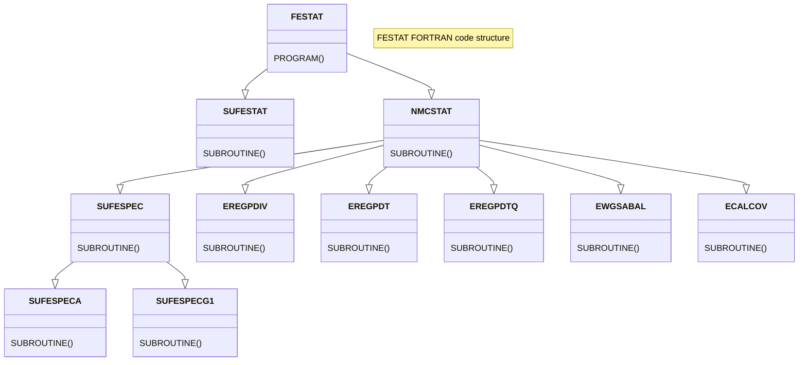

# FESTAT - Forecast Error STATistics: A Technical Summary

## Introduction

The background error statistics (BGE), generally referred to as structure functions, are produced using the standalone FESTAT (Forecast Error Statistics) method. The FESTAT for FA test has been completed and is currently accessible in cycle CY46h1. To mitigate the substantial storage problem, the B-matrix is computed in terms of control vectors, assuming statistical independence among them. The control variables encompass vorticity, divergence, specific humidity, surface pressure, and temperature.

                          **V****D**F** (Forecast Error Vector)  ---------->    Control Vector

Here, **F** represents the horizontal 2-dimensional Fourier transform, transitioning from physical grid point space to spectral space. **D** functions as a balancing operator, and **V** is a vertical transform that utilizes the eigen-vectors of vertical covariance matrices.

The spectral transformation (denoted as **F**) is essential because certain fields are expressed in grid points rather than spectral coefficients. Moreover, FESTAT requires vorticity and divergence derived from geographical wind components in the input FA file. To calculate vorticity and divergence, the initial step involves computing, bi-periodicizing, and smoothing the map factor in spectral space. Subsequently, the wind is reduced by the map factor in gridpoint space. Finally, the wind components are transformed into vorticity and divergence.

The statistical de-correlation operator **D**, also known as the balance operator, is derived in spectral space using multiple regression techniques, performed separately for each wavenumber component. The multiple regression operates stepwise, commencing with the background forecast errors of vorticity, divergence, temperature, surface pressure, and specific humidity in spectral space. In summary, the FESTAT software manages multiple tasks related to the error statistics, including (1) converting variables from gridpoint space to spectral point space, (2) computing the balance operator, (3) generating horizontal variance density spectra for control variables, and (4) determining vertical correlations for the control variables.

## The FESTAT run script

The festat standalone script _runfestat_ reading FA-files has been tested with nine ensemble members. An example of how to run the Festat standalone script with a total 999 files is described below.
### Options
```
[user@localhost ~]$ runfestat -h

NAME
        runfestat.sh - Run FESTAT to ...

USAGE
        runfestat.sh -m <host-name> -x <nprocx> -y <nprocy>
                    [ -t <threads> ]
                    [ -b <binary-directory> ]
                    [ -i <input-directory> ] [ -o <output-directory> ]
                    [ -h ]

DESCRIPTION
        Script to run Forecast component of the AHNS. This script can create
        batch submission headers and run a sample forecast.


OPTIONS
        -m host name
            The name of your platform used in logic contained in this script.
            [ECMWF|LOCAL]
        -x nprocx
            Number of processors in x-direction for 2D domain decomposition

        -y nprocy
            Number of processors in y-direction for 2D domain decomposition

        -t threads
            Number of OpenMP threads [ default : 1 ]

        -b binary-directory
            PATH to FESTAT binary

        -i input-directory

        -o output-directory

[user@localhost ~]$
```

### Example

A total 999 historical FA files were initialized at the assimilation cycle (00, 06 12 and 18 UTC) and for each day. For each assimilation cycle, 9 ensemble forecasts are generated separately. The Variational Data Assimilation (3D-VAR) method is used for the observation assimilation of each ensemble member.

Hence, total FA file is equal to  9 (ens member) X  111 (assimilation cycle)= 999 FA files (6-hr forecast). 

=> NCASES = 999

The _runfestat_ script for FA is driven by a namelist file (fort.4) in the current working directory.

```
&NAMFESTAT
  NCASES=999,
  LSTABAL=.true.,
  LANAFBAL=.true.,
  LELAM=.TRUE.,
  CNAME='ICMSHHARM+0',
  NFRGRP=9,
  NPRINTLEV=0,
  LOZONE=.FALSE.,
  LOZBAL=.FALSE.,
  LUVBAL=.FALSE.,
  OUTBAL='stab.bal'
  OUTCVT='stab.cvt',
  OUTCVU='stab.cv',
/
```

where 

| Name   | Description |
|:-------|:--------------|
|NCASES  |CNAME which is set to fit the name of the native historical files. The actual names of the files will be CNAME completed with a number on 3 digits (from 1 to NCASES). |
|NFRGRP  |NFRGRP represents the number of members per group of files. This variable is serving the former need of femars. The ensemble of files is divided into groups. Each member n of a group, except the last one, is computed as the difference between the historical files n+1 and n ; the latest member of a group is computed as the difference between the historical files 1 and n. In that example the number of members in each group is NFRGRP=6. Consequently the number of groups here is 9. |
|


The nine ensemble member (FA files) are organized into 111 groups. Each member "n" within a group is computed as the difference between the historical files "n+m" and "n," except for the last one. The final member of a group is calculated as the difference between FA files "n" and "m"

It's important to note that the current FORTRAN code is designed for a maximum of 999 FA files. If the number exceeds 999, the sufespeca.F90 program will terminate with the following message.


## Fortran code structure for FESTAT:


here,
- A. FESTAT is the main FORTRAN program that calls two subroutine, SUFESTAT and NMCSTAT
- B. Subroutine SUFESTAT (sufestat.F90) handles the namelist (fort.4) and MPI setup for the program FESTAT. This subroutine program also checks whic file type (FA or GRIB2) to read.
- C. Subroutine NMCSTAT (nmcstat.F90) mainly handles error statistics, covariances using NMC forecast differences. This subroutine is calls multiple subroutines to calculate forecast difference and the error statistics. Some of them are listed below.
- C1. Subroutine SUFESPEC (sufespec.F90) reads input files (CNAME = 'ICMSHHARM+0') either in FA or GRIB2 format.
- C2. Subroutine EREGPDIV (eregpdiv.F90) is used to estimate empirical vertical balance matrix pmat by a linear regression between balanced mass Pb and div. The input data is the horizontal balance coefficient (fact1). The output vertical coefficient matrix for creating balanced Div (PMAT). In addition to that the program writes the total cross-covariance matrix ('covdp.xy').
- C3. Subroutine EREGPDT (eregpdt.F90) Estimate empirical vertical balance matrix stps by a linear regression between (balanced mass, unbalanced div) and (T,ps). The input sets of data are (a)  horizontal balance coefficient (fact1) and (b) vertical coefficient matrix for creating balanced Div (sdiv). The output data are the vertical coefficient matrix for creating balanced T, lnPs  (stps). This subroutine generates output files naming ‘covtp.xy’, ‘cortp.xy’, ‘covpsp.y’, ‘covtd.xy’ and ‘covpsd.y’ .
- C4. Subroutine EREGPDTQ (eregpdtq.F90) estimates empirical vertical balance matrix pmat by a linear regression between (Pb, divu, Tpsu) and q. The input data sets are (a) horizontal balance coefficient (fact1) and (b) vertical coefficient matrix to define balanced div and T, lnP (sdiv and stps). The output data are the vertical coefficient matrix for creating balanced q. This subroutine generates output files naming 'covqp.xy', 'covqd.xy', 'covqt.xy'.
- C5. Subroutine EWGSABAL (ewgsabal.F90) writes a GSA file with the balance linear regression coefficient for stabal96 Jb formulation. 
- C6. Subroutine ECALCOV (ecalcov.F90) Compute covariances as defined by the balance and write them on stat files. The input datasets are (a) horizontal balance coefficient (fact1) and (b) vertical coefficient matrix to define balanced q (sq), and (c) vertical coefficient matrix to define balanced div and T,Ps. This subroutine generates output files naming 'expltlev.y', 'expldlev.y', 'explqlev.y', 'explq_pb.xy', explq_divu.xy', 'expl, q_tpsu.xy', 'explq_wave.y', 'explq_lev.y', 'expltps_pb.xy', 'expltps_divu.xy', 'explt_wave.y', 'explps_wave.y', 'explt_lev.y'.


## References:

1.	https://hirlam.github.io/HarmonieSystemDocumentation/dev/DataAssimilation/StructureFunctions/
2.	https://opensource.umr-cnrm.fr/attachments/5000/festat_guidelines.pdf
3.	https://opensource.umr-cnrm.fr/attachments/4279/festat_for_fa.pdf
4.	https://www.tandfonline.com/doi/full/10.1080/16000870.2019.1615168


